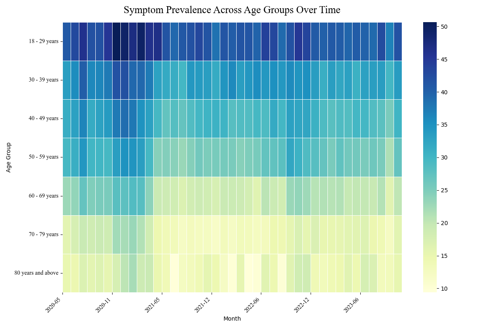
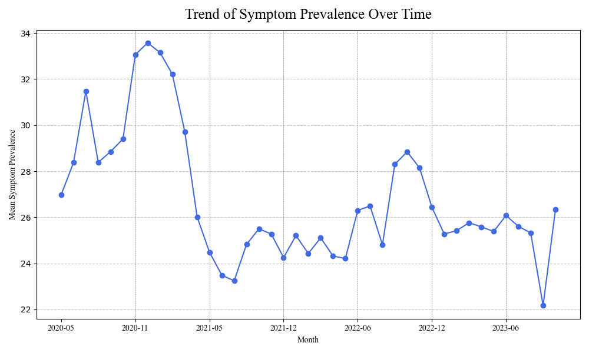
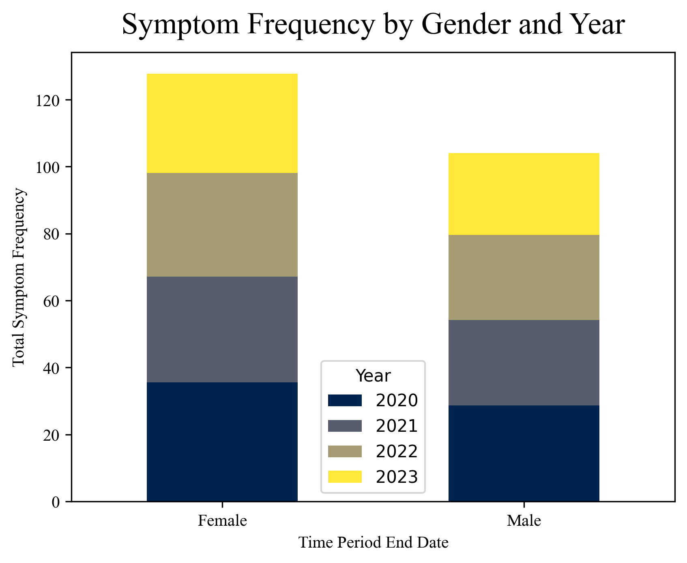
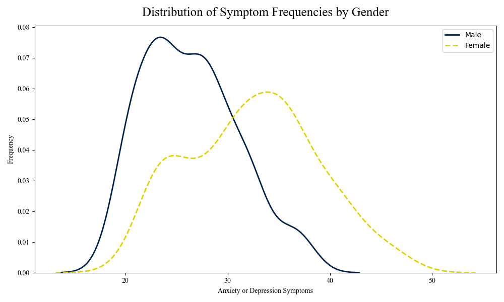
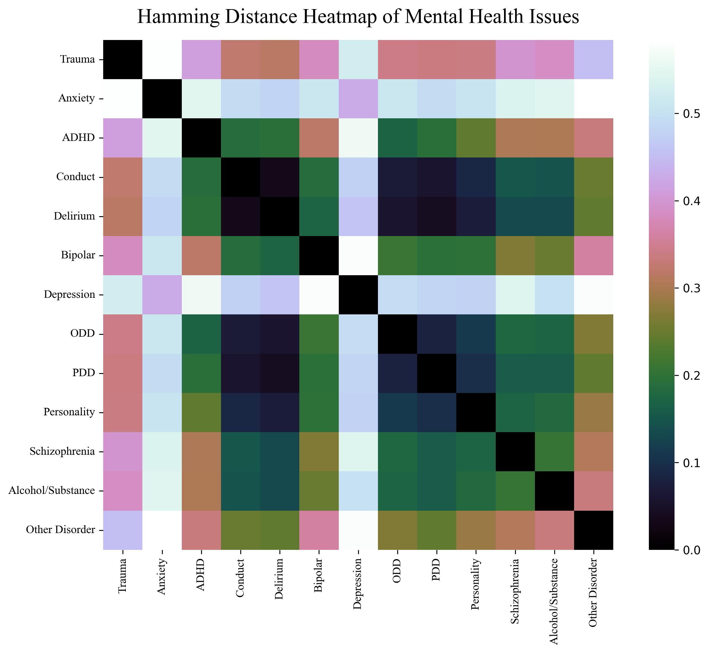
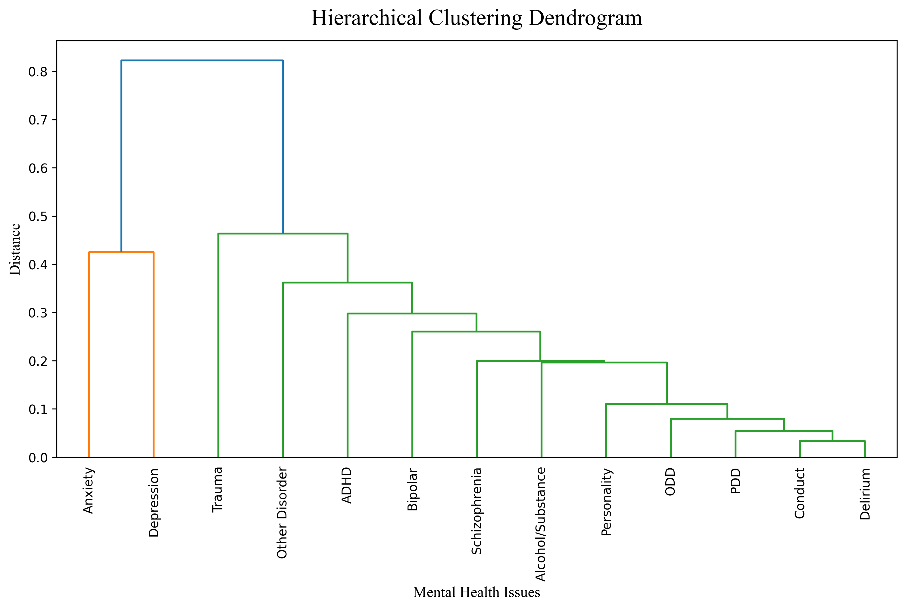

# Mental Health Links

Mental disorders are a significant global concern, impacting millions of lives worldwide, from depression to schizophrenia. Given their complexity and prevalence, understanding the connections between different disorders is crucial for developing effective prevention strategies, interventions, and treatments.
This project explores these connections and influencing factors, providing insights accessible to the general public. It delves into two key questions: How do various mental health disorders interconnect, and what factors influence them?

View [lanjing0803.github.io/da3.html](https://lanjing0803.github.io/mental.html) For Details.
-`mental.pdf`: Pratt Info Show Poster

## Description

This repository serves as an archive for Python files and HTML files used in my personal project. It contains scripts for data cleaning, analysis, and visualization, and other related images.

## EDA

- `EDA/anxiety_levels_EDA.py`: I began analyzing anxiety symptom prevalence and trends using Python.

- `EDA/Symptom_Frequencies_by_gender.py`: Based on the CDC dataset "Indicators of Anxiety or Depression Based on Reported Frequency of Symptoms During Last 7 Days", it suggests that females experience more anxiety and depression symptoms than males.

- `chord.R`: Mapping Mental Disorder Patterns: Co-occurence.
- `EDA/MH2021_cooccur.py`: Mapping Mental Disorder Patterns: Hierarchical Clustering.

The clustering is based on the matrix of Hamming distance, which measures how similar or different these disorders are. To make the results easier to understand, I cleaned up the data by removing cases where only one mental disorder type was present. This helps to remove any confusion caused by irrelevant information.

- `EDA/mca.py`: Using Multivariate Correspondence Analysis (MCA) techniques, I navigated through mental health client-level dataset from SAMHA, to uncover hidden patterns between demographic metrics such as age and gender, and mental health disorders. Utilizing cosine similarity, a pivotal metric in data analysis, I precisely quantify the strength of these relationships, ranging from 0 to 1. A value nearing 1 indicates a higher relation strength, signifying a closer association between demographic factors and specific mental health conditions. 

- `cosine/chord_cs.html`: Interactive Visualization for MCA analysis.
